List the contents of the home directory

"cd" to go to home directory

"ls" to list to list the contents

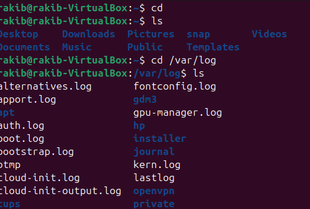

" cd /var/log" to change directory 

"which bash"

echo $SHELL

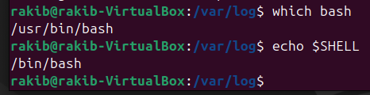

File and Directory Operations

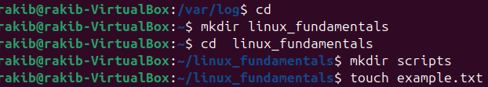

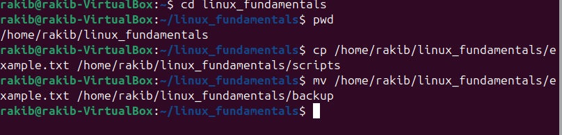

Permission 

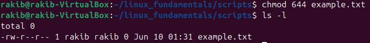

File modification

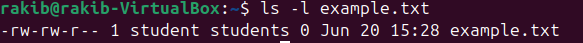

Ownership

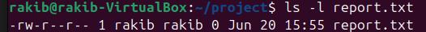
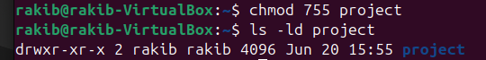

User add/modify

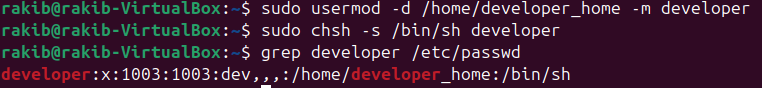
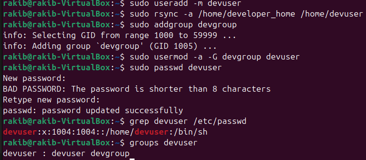

Hard/Soft Link

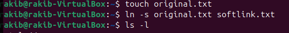

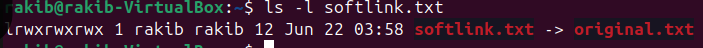

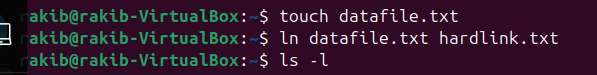

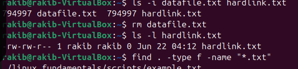

Package installation